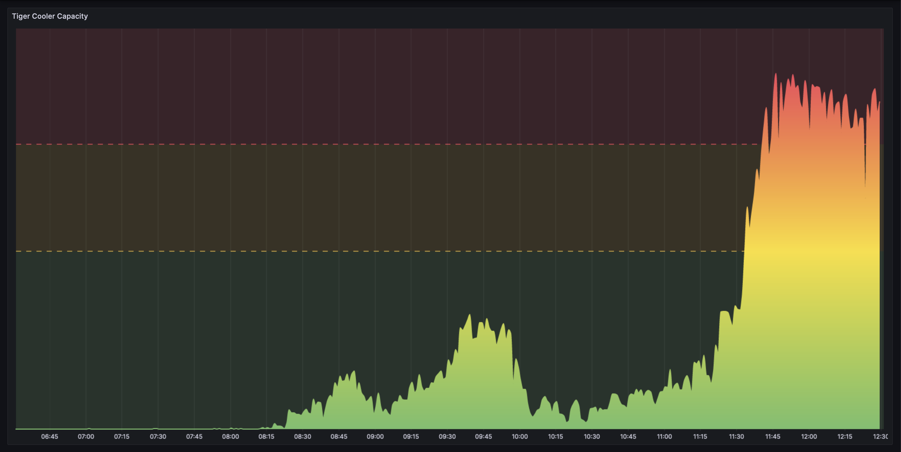
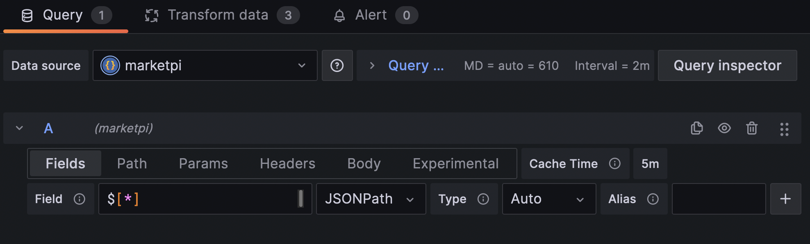
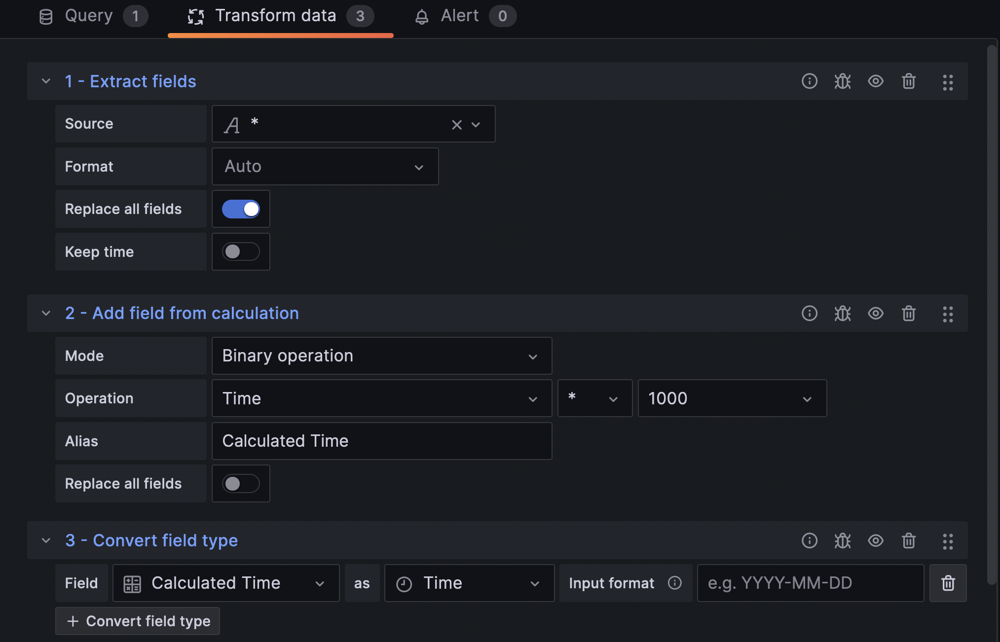

# MarketPi

## A program to plot the current capacity of the marketplace, inspired by [this post](https://matthew.science/posts/occupancy/).

To use, simply place these files onto a Raspberry Pi with Bluetooth. Then add the following to your crontab:

```
* * * * * /usr/bin/flock -n /tmp/fcjmain.lockfile /usr/bin/python3 ~/main.py

* * * * * /usr/bin/flock -n /tmp/fcjserver.lockfile /usr/bin/python3 ~/server.py
```
You will also need to install `tcpdump`.

This will run the program every minute, and will prevent the program from running multiple times at once. It will also run the server, which will allow you to view the data on a webpage.

You can then plot the data with Grafana, or any other plotting software.




